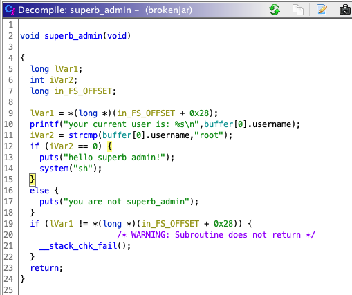
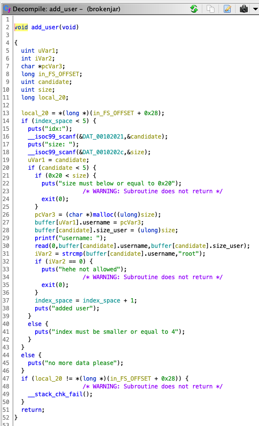

# 8dot8 CTF

[Compañero de crimenes: Federico Videla](https://github.com/acidobinario)

## hHIS

Tu primer caso será superar este sistema de autenticación, para poder acceder a la máquina y proseguir la investigación.

Sabemos que ha sido instalado en el siguiente host: **deneb.hackrocks.com:5000**

**NOTA**: ¡Ningún otro puerto forma parte del reto!

Si vemos el host en el navegador obtenemos:

Nos indica que hemos respondido incorrectamente, a pesar de no haber interactuado con la aplicacion. Sin embargo al abrir el dominio en una terminal utilizando `netcat` obtenemos:

Mucho mejor. Ahora enfoquemosnos en `Qbun wifil qum Muhncuai'm qbcny bilmy?`. Los rotation ciphers son faciles de reconocer:

Ingresamos la respuesta (white) y obtenemos una segunda pregunta:

Y despues de una rapida busqueda en google obtenemos nuestra respuesta:

Finalmente, obtenemos la tercera pregunta:

Ni idea que significa esto

Pero si le damos enter, obtenemos la flag.

## Broken Jar

Opino que este tendria que ser el desafio dificil, obtener la solucion nos costo casi 5 horas.

Descargamos el binario y lo ejecutamos, al tratar de ingresar como "superb admin" retorna un segmentation fault.

Abrimos el binario en ghidra y revisamos la funcion `superb_admin`

Si logramos setear el usuario en el `idx` 0 a `root`, obtendremos un shell. Tratemos:

Revisemos la funcion que anañe usarios

Podemos ver que se realiza un `strcmp` el cual no nos permite ser `root`, entonces, que hacemos?

Debo admitir que nos quedamos atascados en esta parte, no tenemos mucha experiencia con binary reverse engineering, asi que comence a preguntar en grupos por ayuda. Por suerte, alguien vino a nuestro rescate y nos indico que este challenge se parecia demasiado al ejemplo dado en este [writeup](https://infosecwriteups.com/arming-the-use-after-free-bc174a26c5f4)

Probemos en nuestro binario

Funciono, probemos ahora en el server

## One Man Chance

Este fue mucho mas facil que el anterior, creo que tuvo que ser clasificado como medio

Si revisamos el codigo podemos notar dos cosas

1. Tenemos el key `a`: `9123891238912389`
2. El key `b` es un numero random entre `0` y `99999`

Por lo que la decripcion de la flag es muy simple:

Obtenemos la flag encriptada desde el server:

Y realizando un bruteforce, la desencriptamos:

