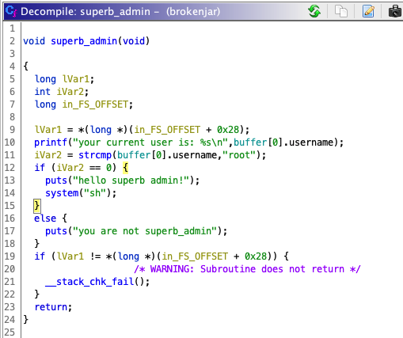

# 8dot8 CTF

[Partner in crime: Federico Videla](https://github.com/acidobinario)

Third place, first place next year >:)

## hHIS

If we go to the host on a browser we see:

It tells us we've answered incorrectly, even though we haven't interacted with the app. However if we go to the host using `netcat` we get:

Much better, now It's an interactive app. Let's focus on `Qbun wifil qum Muhncuai'm qbcny bilmy?`. Rotation ciphers are easy to recognize:

We input the answer (white) and we're prompted with a second question:

After a quick search we get out answer:

After that, we get a third question:

Honestly, no clue what this means:

So I just hit enter:

## Broken Jar

> Federico and I both agreed this should've been the "hard" challenge, it tooks us almost 5 hours to solve it.

If we download the binary and execute it, we see a prompt, if we try to log in as "Superb Admin", it returns an error and segmentation fault.

We open the binary in ghidra and check the function `superb_admin`:

As we can see, if we manage to set the user in `idx` 0 to `root` we'll get a shell. Let's try it:

Let's check the function `add_user`:

We can see it does a `strcmp` which will not allow us to set the user as root, so, what do we do?

Now, I have to admit we remained stuck on this part of the challenge for a few hours, we both don't have much experience with binary RE, so I started asking around for some help. Luckily, someone came to our rescue and pointed out this challenge was very similar to the one given on this [writeup](https://infosecwriteups.com/arming-the-use-after-free-bc174a26c5f4)

Let's try it on our binary:

It worked! Let's try it on the server:

## One Man Chance

> This challenge was much easier than the [previous one](#broken-jar), It should've been the "medium" one

If we check the given code we can notice two things:

1. We have key `a`: `9123891238912389`
2. Key `b` is a "random" number between `0` and `99999`

Which makes decryption really simple:

We get the encrypted flag from the server:

And using our bruteforcing code, we get:

